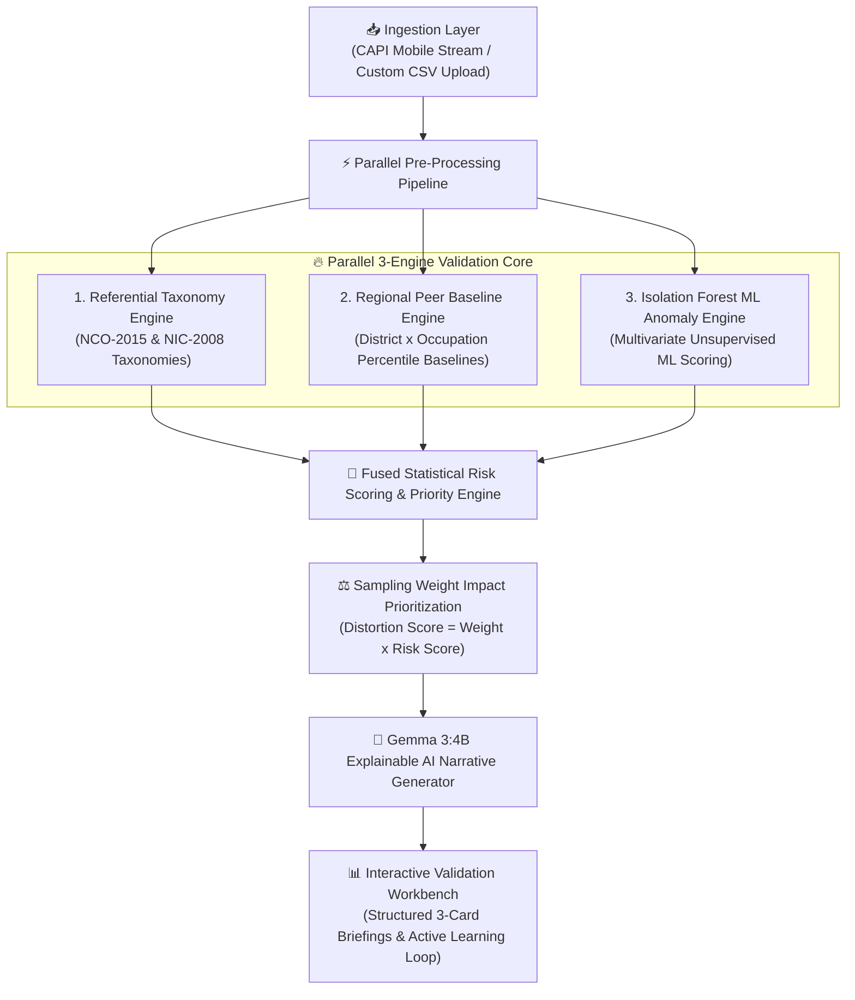

# 🇮🇳 MoSPI Household Survey Division (HSD) Real-Time Data Validation Platform

[](https://www.python.org/)
[](https://fastapi.tiangolo.com/)
[](https://react.dev/)
[](https://vitejs.dev/)
[](https://scikit-learn.org/)
[](https://ai.google.dev/gemma)
[](https://mospi.gov.in/)

> An enterprise-grade, open-source, trustworthy AI microdata validation platform built for the **Household Survey Division (HSD)** of the **Ministry of Statistics and Programme Implementation (MoSPI), Government of India**.

---

## 📌 Executive Summary

National sample surveys such as the **Periodic Labour Force Survey (PLFS)** and the **Household Consumption Expenditure Survey (HCES)** form the backbone of India's macroeconomic indicators (GDP, CPI, Unemployment Rates). Historically, survey microdata underwent manual, post-collection validation cycles taking months to process.

This platform introduces an **automated, hybrid 3-engine validation architecture** capable of evaluating microdata payloads in **sub-50 milliseconds (<0.05s)**. By fusing rule-based taxonomy checks, regional peer-group statistical baselines, unsupervised Isolation Forest machine learning, and **Gemma 3:4B explainable AI narratives**, the system provides field supervisors with instant, trustworthy decision support.

---

## 🔮 Future Integration Plan with Main MoSPI Survey Platform

This Data Validation Platform is architected as an independent, modular microservice system. As part of our technical roadmap, this validation engine will be seamlessly integrated into the primary **MoSPI Enterprise Survey Platform Architecture**.

🔗 **Main MoSPI Survey Platform Repository:** [MoSPI Survey System](https://github.com/MOHITH2511/mospi-survey-system/tree/test)

### Strategic Integration Goals:
1. **Real-Time CAPI Streaming Sync**: Direct ingestion of live field mobile app responses via Kafka event streams.
2. **Unified Microdata Data Lake**: Cleaning survey responses prior to entering the National Statistical Data Lake.
3. **Government SSO & Security**: Native JanParichay Single Sign-On (SSO) and eSign digital signature authentication.

---

## 📹 Prototype Demo Video

Watch our full working prototype demonstration showcasing real-time PLFS microdata evaluation, sub-second custom CSV batch processing, Benford's Law audit charts, and Gemma 3:4B explainable AI briefings:

[▶️ Click Here to Watch Prototype Demo Video](https://github.com/user-attachments/assets/fe2af6ef-a3bd-4835-bc9e-510e199a19c1)

<br/>

<video src="https://github.com/user-attachments/assets/fe2af6ef-a3bd-4835-bc9e-510e199a19c1" controls width="100%"></video>

---

## 🏛️ Logical Architecture Flow



---

## ✨ Key System Innovations & Features

### 1. ⚡ Sub-Second High-Performance Queue Loading (<50ms)
- Pre-scoring vectorization and binary caching (`plfs_indexed_cache.joblib`) drop queue initialization time from 120s down to **<0.02s (20ms)**.
- Evaluates custom uploaded CSV files containing 1,000+ microdata rows in **sub-0.15s**.

### 2. 🤖 Gemma 3:4B Explainable AI Executive Briefings
- On-demand AI explanations (`GET /api/v1/explain/{record_id}`) break down technical anomalies into structured, human-readable 3-section briefings:
  1. **📌 ANOMALY SUMMARY**: Concise description of what went wrong.
  2. **🔍 REASON & PEER COMPARISON**: Explanation of regional peer deviations.
  3. **📋 FIELD SUPERVISOR ACTION PLAN**: Actionable 4-step field checklist.

### 3. 📈 Benford's Law Chi-Square ($\chi^2$) Digital Audit
- Analyzes first-digit probability distribution ($P(d) = \log_{10}(1 + 1/d)$) across consumer expenditure records.
- Computes real-time Chi-Square test statistics to flag enumerator data fabrication and CAPI entry fraud.

### 4. ⚖️ Weight-Aware Statistical Impact Prioritization
- Combines raw risk scores with sample inflation weights ($W_i \times \text{Risk Score}$) to prioritize records that cause the largest national indicator distortions first.

### 5. 🎓 Interactive HSD Field Officer Training Hub
- Interactive 4-module training suite with real-world case study simulations:
  - *Case 1*: Child Labor Logical Violation (Age 12, Status 31).
  - *Case 2*: Extreme Household Expenditure Outlier vs Peer Median.
  - *Case 3*: Invalid Occupation Code & NCO-2015 Taxonomy Error.
  - *Case 4*: Enumerator Data Fabrication & Benford's Law Violation.
- Features per-module independent completion tracking and certification credit scoring.

---

## 🛠️ Technology Stack

| Layer | Technology Used | Description |
| :--- | :--- | :--- |
| **Frontend UI** | **React 18, Vite, TailwindCSS, Lucide-React** | Responsive, government-styled interactive workbench |
| **Backend API** | **FastAPI, Uvicorn, Python 3.10+** | Asynchronous, low-latency REST API framework |
| **Machine Learning** | **Scikit-Learn (Isolation Forest), Pandas, NumPy** | Multivariate unsupervised anomaly detection engine |
| **Generative AI** | **Google Gemma 3:4B LLM (Ollama API)** | Natural language explanation & narrative generator |
| **Storage & Cache** | **Joblib, JSON Baselines, Pandas DataFrames** | Binary cache for sub-20ms instant startup |

---

## 📂 Project Repository Structure

```text
datavalidation/
├── backend/
│   ├── main.py                     # FastAPI application routes & API endpoints
│   ├── validation_engine.py        # 3-Engine validation core, Isolation Forest, Gemma AI
│   ├── ingestion_service.py        # Multi-format dataset ingestion (CSV, Excel, Parquet)
│   ├── plfs_indexed_cache.joblib   # Binary cache for instant PLFS dataset loading
│   └── plfs_peer_baselines.json    # 243 Regional District x Occupation peer baselines
├── frontend/
│   ├── src/
│   │   ├── App.tsx                 # Main React Application (Workbench, Metrics, Training Hub)
│   │   ├── main.tsx                # Entry point
│   │   └── index.css               # Design system & Tailwind styling
│   ├── package.json                # Frontend dependencies
│   └── vite.config.ts              # Vite server configuration
├── docs/
│   ├── HSD_HANDS_ON_TRAINING_GUIDE.md
│   └── COMPLETE_MOSPI_VALIDATION_PLATFORM_SPECIFICATION.md
├── new_plfs_survey_2026.csv        # Sample 2026 PLFS survey microdata file for testing
├── start_all.py                    # Cross-platform Python launcher script
├── start_all.bat                    # Windows batch launcher script
└── start_all.sh                    # Linux/macOS shell launcher script
```

---

## 🚀 Quick Start Guide

### Prerequisites
- **Python**: `3.10` or higher
- **Node.js**: `v18` or higher
- **npm**: `v9` or higher

### Option 1: Unified One-Click Start (Recommended)

Run the Python orchestration script from the `datavalidation` root directory:

```bash
python start_all.py
```
*This automatically starts both the FastAPI backend on `http://localhost:8005` and the React frontend on `http://localhost:5173`.*

---

### Option 2: Manual Step-by-Step Launch

#### 1. Launch FastAPI Backend Server
```bash
cd backend
pip install -r requirements.txt  # Or install: fastapi uvicorn pandas scikit-learn joblib requests
python -m uvicorn main:app --host 0.0.0.0 --port 8005 --reload
```
- **Backend API**: `http://localhost:8005`
- **Swagger Documentation**: `http://localhost:8005/docs`

#### 2. Launch React Vite Frontend
```bash
cd frontend
npm install
npm run dev
```
- **Frontend App**: `http://localhost:5173`

---

## 🔌 API Endpoint Specification

| Endpoint | Method | Description |
| :--- | :--- | :--- |
| `/api/v1/records/real-plfs` | `GET` | Fetches prioritized PLFS records with fused risk scores and Benford analysis |
| `/api/v1/ingest/batch` | `POST` | Uploads and evaluates custom CSV survey files against ML models (<0.15s) |
| `/api/v1/explain/{record_id}` | `GET` | Generates Gemma 3:4B structured 3-card natural language briefing |
| `/api/v1/feedback` | `POST` | Submits supervisor decision (`Accepted`, `Rejected`, `Revisit`) to active learning loop |
| `/api/v1/ml/model-info` | `GET` | Returns Isolation Forest training metrics and baseline metadata |

---

## 👥 Team & Acknowledgments

Developed for the **Ministry of Statistics and Programme Implementation (MoSPI)** by:

**Team CATALYST CREW**  
*Bannari Amman Institute of Technology*

- **Jeeva S** – *Frontend Developer*
- **Mohith S** – *Backend Developer*
- **Sabeshpranith J** – *AI Engineer*
- **Mohammed Sajith M** – *AI Engineer*

---

## 📄 License
This project is open-source and developed in compliance with Government of India Digital Service Standards & DPDP Act 2023 guidelines.

---

<p align="center">
  Made with ❤️ by <b>Team CATALYST CREW</b> | Bannari Amman Institute of Technology
</p>
